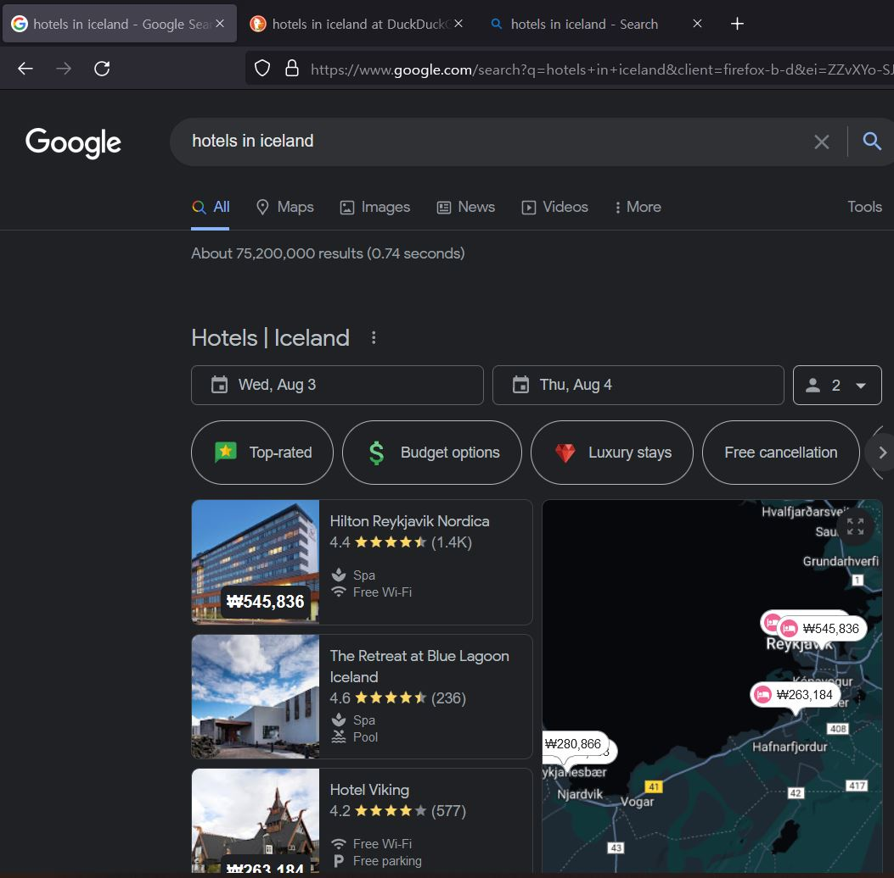

# Search Engines

Google is famous for being the most powerful search engine. But, it's also notorious for collecting personal information. So, I'm thinking of using DuckDuckGo instead of Google. But what if it's not powerful enough? That's what today's test is for.

I have chosen a few search keywords arbitrarily. I also chose 3 search engines, Google, DuckDuckGo and Bing. Let's see how powerful each engine is by comparing the search results of each keyword. I have done all the tests in private mode, so that the results are not affected by my personal data.

## Queries

### What is the second fastest airplane?

I sometimes search in full sentences instead of combinations of words. Google always answers my question directly. Let's how others are doing.

- Google
  - [[big]][[/big]]
- DuckDuckGo
  - [[big]][[/big]]
- Bing
  - [[big]][[/big]]

All the engines give me satisfiable results. You can see that Google is the smartest among those. Google summarizes and highlights the answer, while the others only shows links.

### html name vs id

When I first learned html, I had no idea what's the difference between the `name` attribute and the `id` attribute. So I asked Google.

- Google
  - [[big]][[/big]]
- DuckDuckGo
  - [[big]][[/big]]
- Bing
  - [[big]][[/big]]

Google lost this time. That's interesting. While DuckDuckGo and Bing give me a summarize of the answer, Google doesn't.

### how to make a collapsible table in html

Another html question.

- Google
  - [[big]][[/big]]
- DuckDuckGo
  - [[big]][[/big]]
- Bing
  - [[big]][[/big]]

They all take me to [W3Schools]. Yeah, that's a great website. If you're interested in web developments, the site would be very helpful to you.

### 유재석 나이

Let's see how global they are. I made the query in Korean. The query means 'how old is 유재석(korean comedian)'.

- Google
  - [[big]][[/big]]
- DuckDuckGo
  - [[big]][[/big]]
- Bing
  - [[big]][[/big]]

Google outperforms others. Google literally ***answers*** my question. DuckDuckGo gives me a link where I can get my answer. Bing sucks.

### rust hashmap

I forgot how to iterate key/value pairs with Rust hashmaps. Well, I should read the document. Let's Google it.

- Google
  - [[big]][[/big]]
- DuckDuckGo
  - [[big]][[/big]]
- Bing
  - [[big]][[/big]]

They're all showing the document. Cool.

### hotels in iceland

- Google
  - [[big]][[/big]]
- DuckDuckGo
  - [[big]][[/big]]
- Bing
  - [[big]][[/big]]

Big corporations won this time. They have their own maps.

## Conclusion

I don't see much difference in their results. They're all nice. I'll switch to DuckDuckGo for my privacy. :)