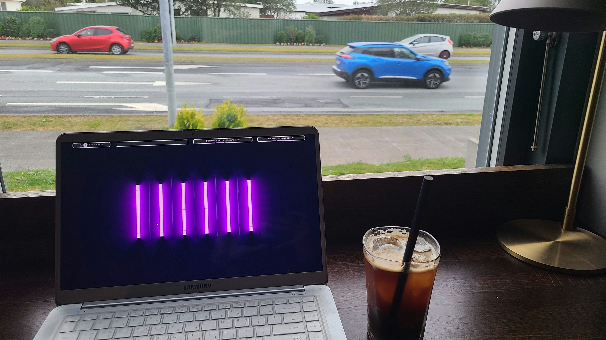

# 5박 6일 레이캬비크 생활기

[[giant]][[/giant]]

레이캬비크는 저렇게 생겼다. 빨간 점선이 경계선이고, 레이캬비크 밖에도 회색 부분에는 도시권이 형성되어 있다. 지도 상에 초록색 마커가 2개가 있는데 윗부분의 마커는 Hallgrímskirkja이고 아랫부분의 마커는 내가 머무른 숙소이다.

Hallgrímskirkja는 아이슬란드에서 가장 큰 교회로, 아이슬란드에게는 정신적으로 중요한 곳 중 하나라고 한다. 한국인에게 경복궁/석굴암같은 느낌인가? Hallgrímskirkja 방문기는 아래의 문단에서 다시 하기로 하고, 레이캬비크 얘기로 돌아가자. 교회를 중심으로 그 북쪽이 레이캬비크의 가장 큰 번화가다.

[[giant]][[/giant]]

[[anchor, id = bhg]][[/anchor]]

빨간 마커가 있는 Hallgrímskirkja를 중심으로 아래의 회색부분에는 주거/숙박 시설에 쭉 늘어서 있고 위의 노란색 부분에는 상업시설이 쭉 늘어서 있다. 상업시설은 대부분 기념품점/식당/마트/서점 등이다. 서울 정도 되는 대도시급의 상업시설은 아니고 인구 15만 도시에 맞는 상업시설인 것 같았다.

## Bónus

Bónus는 아이슬란드에서 가장 큰 마트 브랜드다. 사실 가장 큰지는 나도 모른다. 공식 홈페이지에 따르면 아이슬란드 전역에 32개의 매장이 있다고 한다.

[[big]][[/big]]

Bónus는 귀여운 돼지 마스코트가 있다. 아이슬란드를 돌아다니면 자주 볼 수 있다.

[[big]][[/big]]

매장 겉에만 마스코트가 있는게 아니고 매장 안에도 전부 돼지들로 도배되어 있다. Bónus에서 자체 브랜드로 만든 제품들도 많은데 전부 저 마스코트가 붙어있다.

## Weather

한여름의 아이슬란드는 최고였다. 지난번에 한겨울에 왔을 때는 하루 종일 흐림 + 강풍 + 눈보라로 고생했는데 이번에는 날씨가 너무 좋았다. 5박 6일 동안 첫날에는 비가 조금 오고 (우산 안 써도 문제 없을 정도로 왔다) 나머지는 화창했다. 날씨는 한국의 초봄/늦가을 정도의 날씨다. 점심에는 해도 쨍쨍하고 얇은 면바지 + 반팔티 + 청남방만 입어도 충분하고, 밤에는 조금 두꺼운 후드 하나 입으면 적당했다.

아이슬란드는 여름에는 해가 너무 길고 겨울에는 너무 짧다. 지난번에 한겨울에 왔을 때는 아침 11시에도 깜깜하더니 이번에는 밤 10시에도 해가 안 졌다. 심지어는 밤 12시에 별사진 찍으러 나갔는데 하늘이 완전히 어두워지지가 않아서 다시 들어왔다.

3일차부터는 하늘도 완전히 개서 이뻤다. 아래는 3, 5일차에 찍었던 풍경/하늘 사진들이다.

[[giant]][[/giant]]

3일차에 갔던 Þúfa라는 전망대에서 본 레이캬비크. 가운데 Harpa가 크게 보이고 그 뒤로 Hallgrímskirkja도 보인다. Harpa는 아이슬란드 최대의 콘서트 장이라는데, 우리나라로 치면 예술의 전당 정도 되는 건물인 것 같다.

[[giant]][[/giant]]

3일차에 갔던 아이슬란드 대학교. 나는 해외여행 갈 때마다 그나라 명문대를 꼭 들른다. 아이슬란드는 검색해보니 레이캬비크 대학교, 아이슬란드 대학교가 명문대인 것 같았다. 한국도 서울대, 고려대가 명문대니까.

[[giant]][[/giant]]

5일차에 갔던 Harpa. 가서 공연을 보거나 한 건 없고 건물 구경만 했다.

[[giant]][[/giant]]

5일차에 산책하다가 본 고등학교. 건물이 예뻤다. 아래에는 시냇물이 졸졸 흘러서 꼬마들이 놀고 있었다.

## Hallgrímskirkja

[[giant]][[/giant]]

Hallgrímskirkja는 레이캬비크 최대의 관광지 겸 교회로, 아이슬란드에서 가장 높은 (75m) 건물이다. 이름은 아이슬란드의 시인 Hallgrímur Pétursson에서 따왔다고 한다.

[[giant]][[/giant]]

내부엔 이런 커다란 악기도 있다.

탑에 올라가서 전망을 볼 수도 있다. 올라가는 티켓은 13000원이다. 올라가면 레이캬비크 시내가 다 보이는데 날이 좋아서 너무 예뻤다.

[[big]][[/big]] [[big]][[/big]] [[big]][[/big]]

확실히 북유럽 감성이 느껴지는 풍경이다.

## 도시 풍경 - 교외

난 레이캬비크 바로 옆의 Garðabær라는 마을에 살았다. 우리나라로 치면 광명 정도 되는 도시인 것 같다. 주택가가 평화로우면서도 북유럽의 분위기가 많이 나서 너무 좋았다.

[[giant]][[/giant]]

첫날 도착하자마자 찍은 마을 풍경이다. 새벽이라서 사람이 거의 없다. 바로 앞의 하얀 건물 1층이 내가 카공했던 카페다.

[[giant]][[/giant]]

이것도 첫날 찍은 마을 풍경. 잔디밭 -> 집 -> 잔디밭 -> 집 -> ... 순서로 무한히 반복되고 그 사이에 길이 나있다.

[[giant]][[/giant]]

위에서 말한 무한반복이 대충 이런 느낌이다. 이런 식으로 쭉 늘어서 있는데, 건물들 모양이 조금씩 달라서 보는 맛이 있다.

[[giant]][[/giant]]

마지막날 산책하면서 찍은 마을 풍경.

## 도시 풍경 - 시내

레이캬비크는 Garðabær랑 분위기가 비슷하지만 초록색이 좀 적고 건물이 좀 더 많다.

[[giant]][[/giant]]

[젤 위](#bhg)에서 언급했던 번화가다. 이렇게 생긴 길이 쭉 늘어서 있고 좌우로 상점들이 있다.

[[giant]][[/giant]]

아이슬란드에는 서브웨이가 많다. 도미노 피자도 꽤 흔하게 볼 수 있다. 그대신 스타벅스는 없다. 맥도날드도 한번도 못봤는데 아마 없을 것 같다.

[[giant]][[/giant]]

레이캬비크에서는 바다가 보인다. 특히, 해안도로를 따라 걸으면서 바다를 보면 아주 절경이다. 해안도로를 이틀이나 가긴 했지만 마음에 드는 사진이 없어서 이 글에선 생략...

[[giant]][[/giant]]

2일차에 산책하다가 본 헬스장. 들어가보지는 않았다.

## 대중교통

아이슬란드는 지하철이 없다. 기차도 하나도 없지만 케플라비크 \~ 레이캬비크를 잇는 철도가 생길 예정이라고 한다. 도시와 도시를 잇는 대중교통수단은 버스밖에 없으며, 그마저도 별로 없다. 그래서 도시밖으로 나가려면 자동차가 거의 필수다.

도시 안에서는 [Strætó](https://straeto.is/en)라는 회사가 버스를 운영한다. 도시 + 광역권을 대부분 연결해주며 오전 6시 ~ 밤 11시 30분까지 운행한다. 배차간격은 30분(아침이나 저녁), 15분(오후나 낮)이다. 버스 덕분에 5박 6일간 레이캬비크 생활에 별 지장이 없었다.

버스 요금은 1회 탑승에 5700원, 1일권이 23000원, 3일권은 52000원이다. 나는 3일권으로 2번 끊어서 썼다. 사실 3일권 2번 끊는 것보다 30일권 한번 끊는게 더 싼데 그걸 몰랐다...

결제는 대부분 전용 어플리케이션으로 한다. 현금도 받기는 하는데 거스름돈을 안 주니 조심하자.

## 물가 - 순한맛

아이슬란드는 물가가 비싸기로 악명이 높다. 그래서 이번 여행에서는 가계부도 엄청 꼼꼼히 썼다. 아이슬란드 물가가 얼마나 비싼지 궁금했거든...

[[giant]][[/giant]]

Bónus에서 산 바디워시랑 세제다. 바디워시는 4020원, 세제는 11700원인데, 생각보다 안 비싸다.

아이슬란드 물건은 대부분 영국/덴마크/노르웨이등등에서 수입해 오는 것 같다. 저 친구들도 그렇고 다른 공산품들도 대부분 그랬다.

[[giant]][[/giant]]

마트에서 산 연어. 400그램에 14500원이다. 한국보다도 싸다! 아마 노르웨이랑 거리가 가까워서 그런 것 같다. 나처럼 연어 좋아하는 사람들에게는 괜찮은 것 같다. 다만 연어 구이만 있고 회가 없어서 아쉬웠다. 마트에서는 구이용으로만 팔아서 연어회나 연어초밥은 일식집에서 찾아야했다. 이따 얘기하겠지만 아이슬란드 식당 물가는 무지무지하게 비싸다.

[[icon = wine, size = 420]]

망고쥬스도 많이 샀는데 사진을 못찍었다. 그래서 아이콘으로 대체...ㅠㅠ 망고쥬스 1리터짜리를 2300원에 팔았다. 한국이랑 비교해도 별 차이가 안 난다.

[[giant]][[/giant]]

아이슬란드에서 한국처럼 카공하는게 목표 중 하나였는데 달성했다. 첫날에도 가고 마지막 날에도 갔다. 다른 유럽 국가에는 아이스 아메리카노 찾기가 힘든데 여기는 있어서 좋았다. 저정도 사이즈의 커피가 7900원이었다. 한국에서는 싸면 2000원 비싸면 7000원 정도 하니 한국보다는 좀 비싸다.

## 물가 - 매운맛

지금까지는 물가 순한맛이었고 이제부터는 매운맛이다. 아이슬란드는 인건비가 세다. (사실 잘 모르지만 그런 것 같다.) 아마 1인당 GDP 8만 달러인데 관광 비중이 크니 그런 것 같다. 그래서 인건비 비중이 높아질수록 가격이 폭등했다. 아까 말한 버스 가격이 한국보다 훨씬 비싼 것도 그 이유인 것 같다.

[[giant]][[/giant]]

2일차에 갔던 Perlan이라는 박물관이다. 아이슬란드의 자연, 물 (아이슬란드는 수자원 강국이다) 등에 대해서 설명했는데 내용은 만족스러웠다. 입장료는 무려 5만 3천원...

[[giant]][[/giant]]

3일차에 저녁으로 먹었던 연어 스테이크. 음식점에 가서 가장 아이슬란드스러운 걸 달라고 하니 저걸 줬다. 맛은 아주 만족스러웠다. 연어스테이크는 59000원, 맥주는 16000원이었다. 한국과 가격을 비교하기가 애매한게, 원래 고급 레스토랑은 가격이 너무 천차만별이다. 한국에서 평범한 레스토랑에서 저렇게 먹었으면 3만원도 안 나왔겠지만 분위기 좋은 곳은 10만원도 넘어갈 수도 있다. 그래도 어쨌든 한국보다는 비싼 것 같다.

[[giant]][[/giant]]

첫날 저녁으로 먹었던 한식. 분명 한식집에 갔는데 저걸 줬다. 저게 그 식당에서 제일 한국스러운 음식이었다. 쨌든 저렇게 맥주 2잔 + 윙봉 8조각 해서 39000원이었다. 한국에선 저렇게 먹으면 저 가격 절대 안 나온다.

[[giant]][[/giant]]

아이슬란드 간 김에 아이슬란드어 교재도 하나 샀다. 한국에는 아이슬란드어 교재가 없어서 현지에서 직접 공수했다. 200 페이지 조금 넘는 조그마한 책이 무려 11만원이다. 나무가 없어서 종이가 비싼가?

## 사람

아이슬란드 사람들은 착하다. 내가 워낙 아이슬란드를 좋아해서 확증편향일 수도 있지만, 쨌든 다른 유럽 도시 사람들에 비해 훨씬 착하다.

아이슬란드 사람들은 영어를 잘한다. 내가 가본 비영어권 국가 중에서 압도적으로 1등인 것 같다. 독일보다도 잘하는 것 같다. 유럽의 다른 나라는 관광지여도 가끔씩 영어를 아예 못하는 사람이 있었는데 여기서는 관광지든 아니든 영어를 아예 못하는 사람은 한명도 못 봤다. 내가 봤던 영어를 제일 못했던 사람이 3년 전에 왔을 때 통화했던 아이슬란드 경찰이었는데, 그 사람도 간신히 문장은 만들 수 있었다.

아이슬란드에서 인종차별은 한번도 안 당했다. 프랑스나 이탈리아, 스페인 같은 나라보단 훨씬 나은 것 같다. 다만 도시에 아시안이 너무 없었다. 런던이나 파리, 뮌헨을 가면 온갖 인종이 섞여있어서 아시안도 자연스럽게 녹아드는 느낌을 받았다. 근데 여기는 시내 한복판에도 대부분 북유럽 핏줄 사람들이고, 내가 머물던 동네는 나빼고 전부 북유럽 핏줄이었다. 아마 이 동네 사람들은 내가 신기했을 거다.

아이슬란드에도 kpop이 들어와 있다. 셋째날에 간 서점에서 직원분이 카라 <Mr>를 듣고 계셨다. 아는 척을 하니까 고개를 숙이면서 "안녕하세요"하고 인사도 하셨다. 한국 문화를 대충 아시는 분 같았다. 만km 넘게 떨어진 곳에도 한국을 잘 아는 분이 계셔서 신기했다.
